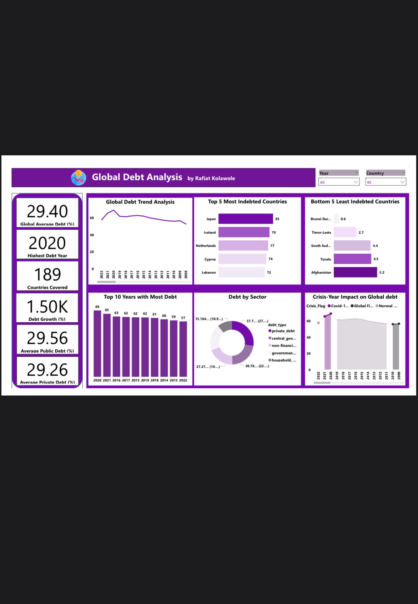

# Global Debt Analysis

## Project Overview
This project analyzes global economic debt trends using Power BI to understand how different types of debt have evolved over time and how major global events influenced borrowing behavior.

The analysis focuses on central government debt, general government debt, private debt, non-financial corporate debt, and household debt across multiple years.

## Tools Used
- Power BI
- Data Cleaning & Transformation
- Data Modeling
- Data Visualization

## Objectives
- Examine trends across different debt categories
- Identify periods of significant increases and declines in global debt
- Understand the impact of global economic crises on debt levels

## Key Insights
- Private debt recorded the highest levels globally, followed by central government debt, while household debt remained the lowest.
- Global debt levels peaked in **2020**, driven by the COVID-19 pandemic as governments and private sectors borrowed heavily to stabilize economies.
- A major spike in debt occurred around **2007**, aligning with the global financial crisis.
- Debt levels declined in **2021 and 2022**, indicating a gradual post-pandemic correction.

## Conclusion
This analysis demonstrates how global crises significantly influence borrowing behavior, fiscal policy decisions, and long-term debt sustainability. It also highlights the interconnected nature of the global economy.

## Dashboard Preview

